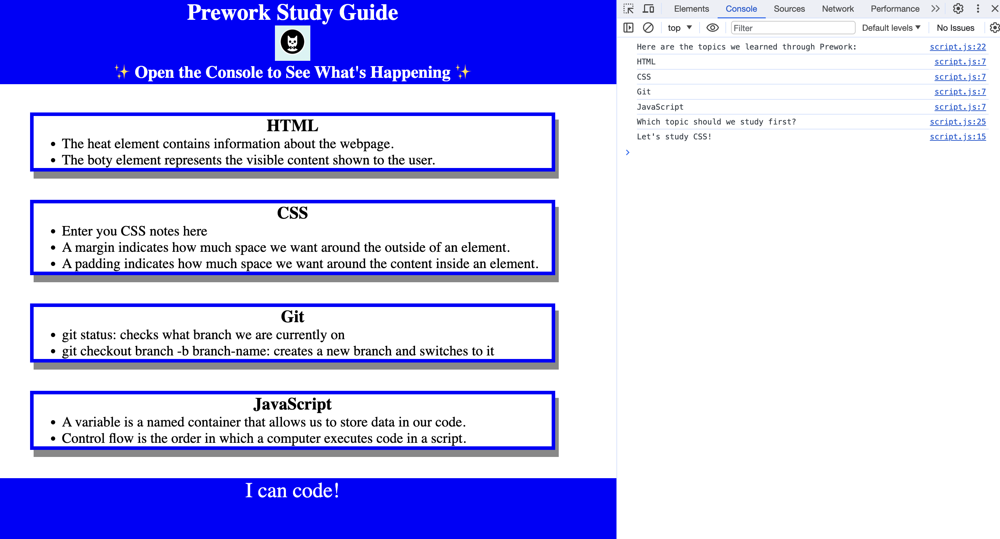

# Study Guide Webpage

## Description

This Study Guide was created for boot camp students who were going through the Prework. The goal is to provide a single location to easily learn the basics of web development! It contains notes on HTML, CSS, Git, and JavaScript. creating this webpage allowed me familiarize with git workflow and learn the basics of HTML, CSS, and JavaScript.

## Installation

N/A

## Usage

To use this Study Guide, you can review the notes in each section. For suggestions on what topic to study first, open the Chrome DevTools by pressing Command+Option+I (MacOS) or Control+shift+I (Windows). A console panel should open either below or to the side of the webpage in the browser. There you will see a list of topics we learned along from Preworkalong with a suggestion on which topic to study first.

## Credits

N/A

## License

This project uses the MIT license.

## Badges

https://img.shields.io/badge/prework-Git,_HTML,_CSS,_JavaScript-purple

## Features

Topics are organized in to four easy to read sections using HTML and CSS. 

JavaSccript is used to add interactivity to the webage, allowing users to be more engaged.

## How to Contribute

Please contribute by adding beginner tips to the specific lists in the HTML file!

